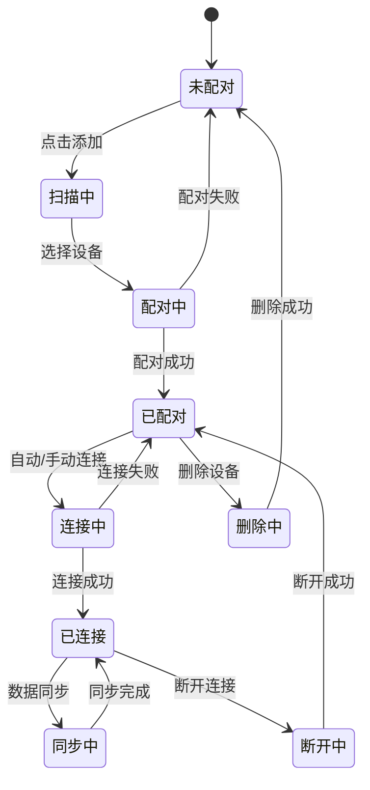

# 全局导航与设备管理

## 1. 导航系统设计

### 1.1 导航架构

#### 底部导航栏（Tab Bar）
```
┌────────────────────────────────────────────────┐
│                  内容区域                       │
│                                                │
│                                                │
│                                                │
├────────────────────────────────────────────────┤
│  ┌──────┬──────┬──────┬──────┬──────┐        │
│  │ 角色 │ 体验 │  🔗  │ 控制 │ 我的 │        │
│  └──────┴──────┴──────┴──────┴──────┘        │
└────────────────────────────────────────────────┘

图标规范：
- 默认状态：线性图标，灰色(#999999)
- 选中状态：填充图标，主题色(#FF6B6B)
- 设备按钮：中心凸起设计，动态状态显示
```

### 1.2 页面路由结构

```javascript
const routes = {
  main: {
    character: '/character',        // 角色展示
    experience: '/experience',      // 沉浸体验
    device: '/device',              // 设备中心(浮层)
    control: '/control',            // 控制界面
    profile: '/profile'             // 个人中心
  },
  sub: {
    // 角色相关
    characterDetail: '/character/:id',
    characterInteraction: '/character/:id/interact',
    
    // 体验相关
    storyList: '/experience/story',
    storyPlay: '/experience/story/:id',
    audioPlayer: '/experience/audio',
    audioImport: '/experience/import',
    
    // 设备相关
    deviceAdd: '/device/add',
    deviceSettings: '/device/:id/settings',
    
    // 控制相关
    presetModes: '/control/presets',
    customEdit: '/control/custom',
    
    // 个人相关
    settings: '/profile/settings',
    account: '/profile/account'
  }
}
```

### 1.3 导航状态管理

```typescript
interface NavigationState {
  currentTab: TabType;
  previousTab: TabType;
  navigationStack: NavigationItem[];
  deviceButtonState: DeviceButtonState;
  badgeCount: BadgeInfo;
}

enum TabType {
  CHARACTER = 'character',
  EXPERIENCE = 'experience',
  DEVICE = 'device',
  CONTROL = 'control',
  PROFILE = 'profile'
}

interface DeviceButtonState {
  status: 'unregistered' | 'disconnected' | 'connected' | 'syncing';
  animation: 'none' | 'pulse' | 'rotate';
  color: string;
  badge?: number;
}
```

## 2. 设备管理系统

### 2.1 设备生命周期



### 2.2 设备数据模型

```typescript
interface Device {
  // 基础信息
  id: string;                    // 设备唯一ID
  name: string;                   // 设备名称（可编辑）
  model: string;                  // 设备型号
  macAddress: string;             // MAC地址
  
  // 连接信息
  connectionStatus: ConnectionStatus;
  signalStrength: number;         // -100 ~ 0 dBm
  lastConnectedTime: Date;
  
  // 状态信息
  batteryLevel: number;           // 0-100
  firmwareVersion: string;
  isCharging: boolean;
  
  // 配置信息
  settings: DeviceSettings;
  supportedFeatures: Feature[];
  
  // 使用统计
  totalUsageTime: number;         // 秒
  lastSyncTime: Date;
}

interface DeviceSettings {
  autoConnect: boolean;
  notificationEnabled: boolean;
  vibrationIntensity: number;     // 0-100
  ledBrightness: number;          // 0-100
  sleepMode: boolean;
  customName?: string;
}

enum ConnectionStatus {
  DISCONNECTED = 'disconnected',
  CONNECTING = 'connecting',
  CONNECTED = 'connected',
  SYNCING = 'syncing',
  ERROR = 'error'
}
```

### 2.3 设备发现与配对

#### 扫描流程
```typescript
class DeviceScanner {
  private scanTimeout = 30000; // 30秒超时
  private scanInterval = 1000; // 1秒刷新
  
  async startScan(): Promise<DiscoveredDevice[]> {
    // 1. 检查蓝牙权限
    await this.checkPermissions();
    
    // 2. 开启蓝牙
    await this.enableBluetooth();
    
    // 3. 开始扫描
    const devices = await this.scanForDevices({
      services: ['SERVICE_UUID'],
      allowDuplicates: false,
      scanMode: 'lowLatency'
    });
    
    // 4. 过滤和排序
    return this.filterAndSort(devices);
  }
  
  private filterAndSort(devices: RawDevice[]): DiscoveredDevice[] {
    return devices
      .filter(d => d.name?.startsWith('DEVICE_PREFIX'))
      .sort((a, b) => b.rssi - a.rssi)
      .map(d => this.mapToDiscoveredDevice(d));
  }
}
```

#### 配对界面
```
┌─────────────────────────────────────┐
│        发现新设备                    │
├─────────────────────────────────────┤
│                                     │
│  正在搜索附近的设备...              │
│                                     │
│  ┌─────────────────────────────┐   │
│  │ 📱 Device_001               │   │
│  │    信号: ████░  电量: 85%   │   │
│  └─────────────────────────────┘   │
│                                     │
│  ┌─────────────────────────────┐   │
│  │ 📱 Device_002               │   │
│  │    信号: ███░░  电量: 62%   │   │
│  └─────────────────────────────┘   │
│                                     │
│  [  重新扫描  ]  [  取消  ]        │
└─────────────────────────────────────┘
```

### 2.4 设备连接管理

#### 连接策略
```typescript
class ConnectionManager {
  // 自动重连配置
  private readonly maxRetries = 3;
  private readonly retryDelay = [1000, 3000, 5000]; // 递增延迟
  
  // 连接优先级
  private readonly connectionPriority = {
    manual: 1,      // 手动连接最高优先级
    auto: 2,        // 自动连接
    background: 3   // 后台连接
  };
  
  async connect(device: Device, options?: ConnectOptions): Promise<boolean> {
    try {
      // 1. 检查设备状态
      if (!this.isDeviceAvailable(device)) {
        throw new Error('Device not available');
      }
      
      // 2. 建立连接
      await this.establishConnection(device, options);
      
      // 3. 验证连接
      await this.verifyConnection(device);
      
      // 4. 同步数据
      await this.syncDeviceData(device);
      
      return true;
    } catch (error) {
      await this.handleConnectionError(error, device);
      return false;
    }
  }
  
  private async handleConnectionError(error: Error, device: Device) {
    if (this.shouldRetry(error)) {
      await this.scheduleRetry(device);
    } else {
      this.notifyConnectionFailed(device, error);
    }
  }
}
```

#### 连接状态监控
```typescript
class ConnectionMonitor {
  private heartbeatInterval = 5000; // 5秒心跳
  private timeoutThreshold = 15000; // 15秒超时
  
  startMonitoring(device: Device) {
    // 心跳检测
    this.heartbeatTimer = setInterval(() => {
      this.sendHeartbeat(device);
    }, this.heartbeatInterval);
    
    // 信号强度监控
    this.rssiTimer = setInterval(() => {
      this.updateSignalStrength(device);
    }, 1000);
    
    // 电量监控
    this.batteryTimer = setInterval(() => {
      this.updateBatteryLevel(device);
    }, 60000); // 每分钟更新
  }
  
  private async sendHeartbeat(device: Device) {
    try {
      const response = await device.sendCommand('HEARTBEAT');
      if (!response || Date.now() - response.timestamp > this.timeoutThreshold) {
        this.handleTimeout(device);
      }
    } catch (error) {
      this.handleDisconnection(device);
    }
  }
}
```

## 3. 设备列表界面

### 3.1 单设备视图

```
┌─────────────────────────────────────┐
│         我的设备                     │
├─────────────────────────────────────┤
│                                     │
│  ┌─────────────────────────────┐   │
│  │     [设备图标]                │   │
│  │                              │   │
│  │    Device_001                │   │
│  │    ● 已连接                  │   │
│  │                              │   │
│  │  ┌────────────────────┐     │   │
│  │  │ 🔋 85%  📶 -45dBm │     │   │
│  │  └────────────────────┘     │   │
│  │                              │   │
│  │  [断开连接] [设备设置]       │   │
│  └─────────────────────────────┘   │
│                                     │
│  使用统计                           │
│  ├─ 今日使用: 2小时35分钟          │
│  ├─ 累计使用: 125小时              │
│  └─ 上次同步: 5分钟前              │
│                                     │
└─────────────────────────────────────┘
```

### 3.2 多设备列表

```
┌─────────────────────────────────────┐
│         我的设备 (3)                │
├─────────────────────────────────────┤
│                                     │
│  当前设备                           │
│  ┌─────────────────────────────┐   │
│  │ 📱 Device_001    ● 已连接   │   │
│  │    🔋 85%  📶 强            │   │
│  └─────────────────────────────┘   │
│                                     │
│  其他设备                           │
│  ┌─────────────────────────────┐   │
│  │ 📱 Device_002    ○ 未连接   │   │
│  │    上次连接: 昨天            │   │
│  └─────────────────────────────┘   │
│  ┌─────────────────────────────┐   │
│  │ 📱 Device_003    ○ 未连接   │   │
│  │    上次连接: 3天前           │   │
│  └─────────────────────────────┘   │
│                                     │
│  [+ 添加新设备]                     │
│                                     │
└─────────────────────────────────────┘
```

## 4. 设备设置页面

### 4.1 设置项结构

```typescript
interface DeviceSettingsPage {
  sections: [
    {
      title: "基础设置",
      items: [
        { type: "input", label: "设备名称", key: "deviceName" },
        { type: "switch", label: "自动连接", key: "autoConnect" },
        { type: "switch", label: "消息通知", key: "notifications" }
      ]
    },
    {
      title: "控制设置",
      items: [
        { type: "slider", label: "震动强度", key: "vibrationIntensity", min: 0, max: 100 },
        { type: "slider", label: "LED亮度", key: "ledBrightness", min: 0, max: 100 },
        { type: "switch", label: "睡眠模式", key: "sleepMode" }
      ]
    },
    {
      title: "高级设置",
      items: [
        { type: "button", label: "固件更新", action: "checkFirmware" },
        { type: "button", label: "恢复出厂", action: "factoryReset" },
        { type: "button", label: "删除设备", action: "removeDevice", style: "danger" }
      ]
    }
  ]
}
```

### 4.2 设置界面布局

```
┌─────────────────────────────────────┐
│  ← 设备设置                         │
├─────────────────────────────────────┤
│                                     │
│  基础设置                           │
│  ┌─────────────────────────────┐   │
│  │ 设备名称                     │   │
│  │ [Device_001              ]  │   │
│  ├─────────────────────────────┤   │
│  │ 自动连接              [ON] │   │
│  ├─────────────────────────────┤   │
│  │ 消息通知              [ON] │   │
│  └─────────────────────────────┘   │
│                                     │
│  控制设置                           │
│  ┌─────────────────────────────┐   │
│  │ 震动强度                     │   │
│  │ ────●────────── 75%         │   │
│  ├─────────────────────────────┤   │
│  │ LED亮度                      │   │
│  │ ──────●──────── 50%         │   │
│  ├─────────────────────────────┤   │
│  │ 睡眠模式             [OFF] │   │
│  └─────────────────────────────┘   │
│                                     │
│  关于设备                           │
│  ├─ 型号: Model_X                  │
│  ├─ 固件: v2.1.0                   │
│  ├─ MAC: AA:BB:CC:DD:EE:FF        │
│  └─ 序列号: SN20240001             │
│                                     │
└─────────────────────────────────────┘
```

## 5. 通知与提示系统

### 5.1 设备状态通知

```typescript
enum NotificationType {
  DEVICE_CONNECTED = 'device_connected',
  DEVICE_DISCONNECTED = 'device_disconnected',
  LOW_BATTERY = 'low_battery',
  FIRMWARE_UPDATE = 'firmware_update',
  CONNECTION_ERROR = 'connection_error',
  SYNC_COMPLETE = 'sync_complete'
}

interface DeviceNotification {
  type: NotificationType;
  title: string;
  message: string;
  deviceId: string;
  timestamp: Date;
  priority: 'high' | 'medium' | 'low';
  actions?: NotificationAction[];
}

// 通知示例
const notifications = {
  connected: {
    title: "设备已连接",
    message: "Device_001 连接成功",
    priority: "medium"
  },
  lowBattery: {
    title: "电量低",
    message: "Device_001 电量仅剩15%，请及时充电",
    priority: "high",
    actions: [
      { label: "知道了", action: "dismiss" },
      { label: "查看详情", action: "viewDevice" }
    ]
  }
};
```

### 5.2 引导提示

```typescript
class DeviceOnboarding {
  steps = [
    {
      id: 'welcome',
      title: '欢迎使用',
      content: '让我们开始连接您的第一个设备',
      action: 'next'
    },
    {
      id: 'bluetooth',
      title: '开启蓝牙',
      content: '请确保您的手机蓝牙已开启',
      action: 'checkBluetooth'
    },
    {
      id: 'scan',
      title: '扫描设备',
      content: '请将设备靠近手机，点击扫描',
      action: 'startScan'
    },
    {
      id: 'connect',
      title: '连接设备',
      content: '选择您的设备进行连接',
      action: 'selectDevice'
    },
    {
      id: 'complete',
      title: '连接成功',
      content: '您已成功连接设备，开始体验吧！',
      action: 'finish'
    }
  ];
}
```

## 6. 性能优化

### 6.1 连接优化

```typescript
class ConnectionOptimizer {
  // 连接缓存
  private connectionCache = new Map<string, CachedConnection>();
  
  // 连接池
  private connectionPool = new ConnectionPool({
    maxConnections: 5,
    keepAliveTime: 30000
  });
  
  // 预连接策略
  async preConnect(devices: Device[]) {
    // 根据使用频率排序
    const sortedDevices = this.sortByUsageFrequency(devices);
    
    // 预连接前N个设备
    const preConnectCount = Math.min(2, sortedDevices.length);
    for (let i = 0; i < preConnectCount; i++) {
      this.connectionPool.prepare(sortedDevices[i]);
    }
  }
  
  // 智能重连
  async smartReconnect(device: Device) {
    const strategy = this.determineReconnectStrategy(device);
    
    switch (strategy) {
      case 'immediate':
        return this.connectImmediately(device);
      case 'delayed':
        return this.connectWithDelay(device, 5000);
      case 'background':
        return this.connectInBackground(device);
      default:
        return false;
    }
  }
}
```

### 6.2 数据同步优化

```typescript
class DataSyncOptimizer {
  // 增量同步
  async incrementalSync(device: Device) {
    const lastSyncTime = device.lastSyncTime;
    const changes = await this.getChangesSince(lastSyncTime);
    
    if (changes.length > 0) {
      await this.applyChanges(device, changes);
    }
  }
  
  // 批量操作
  async batchOperations(operations: Operation[]) {
    const batches = this.groupOperations(operations);
    
    for (const batch of batches) {
      await this.executeBatch(batch);
    }
  }
  
  // 压缩传输
  async compressData(data: any): Promise<Uint8Array> {
    const jsonString = JSON.stringify(data);
    return this.gzipCompress(jsonString);
  }
}
```

## 7. 错误处理

### 7.1 错误类型定义

```typescript
enum DeviceErrorCode {
  BLUETOOTH_OFF = 'E001',
  DEVICE_NOT_FOUND = 'E002',
  CONNECTION_TIMEOUT = 'E003',
  AUTHENTICATION_FAILED = 'E004',
  DEVICE_BUSY = 'E005',
  LOW_BATTERY = 'E006',
  FIRMWARE_INCOMPATIBLE = 'E007',
  PERMISSION_DENIED = 'E008'
}

class DeviceError extends Error {
  constructor(
    public code: DeviceErrorCode,
    public message: string,
    public device?: Device,
    public retryable: boolean = false
  ) {
    super(message);
  }
}
```

### 7.2 错误恢复策略

```typescript
class ErrorRecovery {
  async handleError(error: DeviceError): Promise<RecoveryResult> {
    const strategy = this.getRecoveryStrategy(error.code);
    
    switch (strategy) {
      case 'retry':
        return this.retryOperation(error);
        
      case 'reconnect':
        return this.reconnectDevice(error.device);
        
      case 'reset':
        return this.resetConnection(error.device);
        
      case 'manual':
        return this.requestUserAction(error);
        
      default:
        return { success: false, error };
    }
  }
  
  private getRecoveryStrategy(code: DeviceErrorCode): RecoveryStrategy {
    const strategies = {
      [DeviceErrorCode.CONNECTION_TIMEOUT]: 'retry',
      [DeviceErrorCode.DEVICE_BUSY]: 'retry',
      [DeviceErrorCode.AUTHENTICATION_FAILED]: 'reconnect',
      [DeviceErrorCode.BLUETOOTH_OFF]: 'manual',
      [DeviceErrorCode.PERMISSION_DENIED]: 'manual'
    };
    
    return strategies[code] || 'manual';
  }
}
```

## 8. 测试用例

### 8.1 设备连接测试

```typescript
describe('Device Connection Tests', () => {
  test('成功连接新设备', async () => {
    const device = mockDevice();
    const result = await connectionManager.connect(device);
    expect(result).toBe(true);
    expect(device.connectionStatus).toBe('connected');
  });
  
  test('连接超时处理', async () => {
    const device = mockDevice();
    jest.setTimeout(5000);
    const result = await connectionManager.connect(device, { timeout: 1000 });
    expect(result).toBe(false);
    expect(device.connectionStatus).toBe('disconnected');
  });
  
  test('自动重连机制', async () => {
    const device = mockConnectedDevice();
    await connectionManager.disconnect(device);
    await wait(2000);
    expect(device.connectionStatus).toBe('connected');
  });
});
```

## 更新历史

| 版本 | 日期 | 更新内容 | 更新人 |
|------|------|---------|--------|
| v2.0 | 2025-08-07 | 完整的导航和设备管理文档 | System |
| v1.0 | 2025-08-01 | 初始版本 | System |