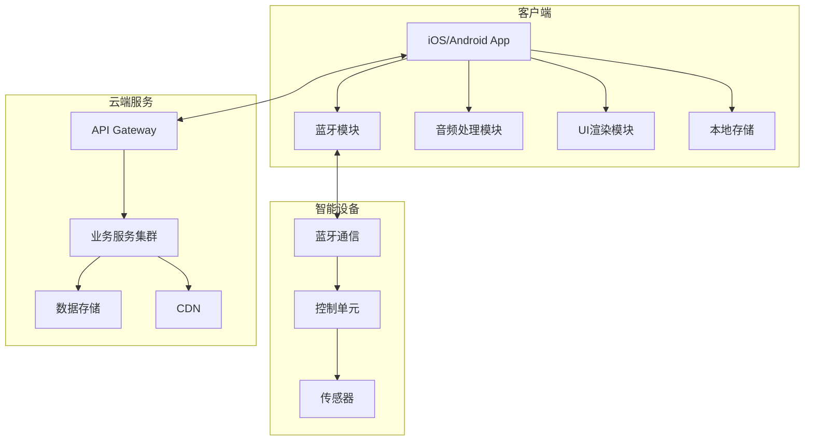
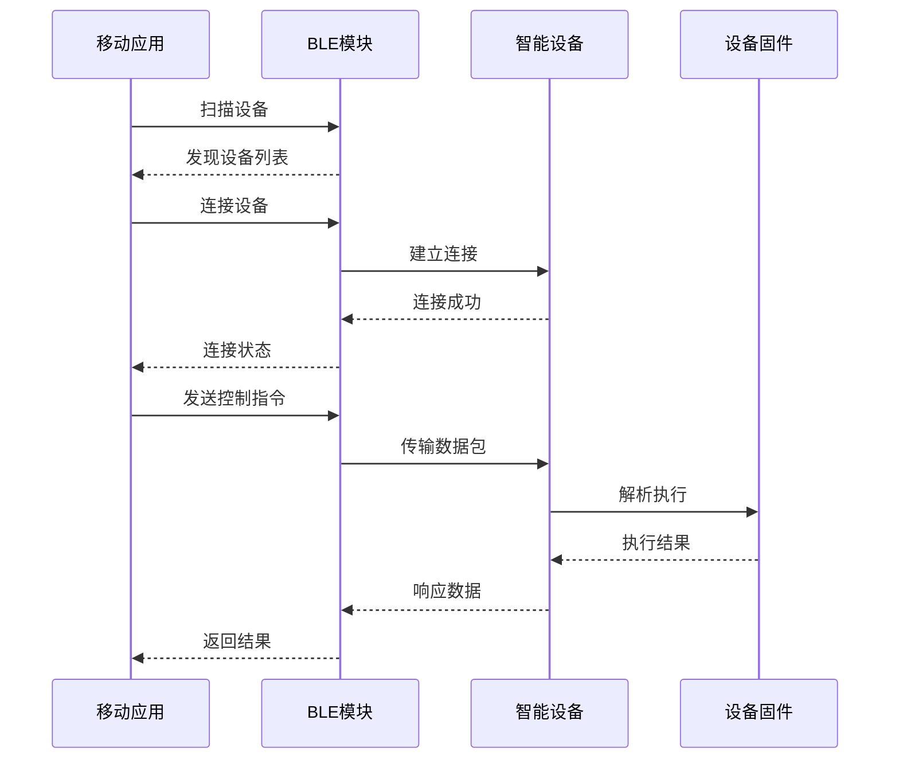
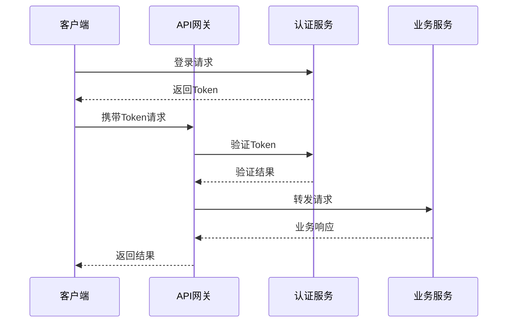

# 系统架构设计

## 1. 架构概述

### 1.1 设计原则
- **模块化设计**：功能模块独立，低耦合高内聚
- **可扩展性**：支持功能扩展和性能扩展
- **高可用性**：系统稳定性99.9%以上
- **安全性**：数据加密、权限控制、安全审计
- **性能优先**：响应时间<100ms，流畅体验
- **跨平台一致性**：iOS/Android体验统一

### 1.2 技术选型原则
- 成熟稳定的技术栈
- 活跃的社区支持
- 良好的文档和工具链
- 团队技术储备匹配
- 性能和开发效率平衡

## 2. 系统整体架构

### 2.1 四层架构模型

```
┌─────────────────────────────────────────────────────────┐
│                     表现层 (Presentation Layer)          │
├─────────────────────────────────────────────────────────┤
│  iOS App          │    Android App    │    Web Admin    │
│  - SwiftUI        │    - Jetpack      │    - React      │
│  - UIKit          │    - Compose      │    - Ant Design │
└───────────────────┴────────────────────┴─────────────────┘
                              ↕
┌─────────────────────────────────────────────────────────┐
│                   应用层 (Application Layer)             │
├─────────────────────────────────────────────────────────┤
│  业务逻辑处理                                            │
│  ┌─────────┬─────────┬─────────┬─────────┬──────────┐ │
│  │设备管理 │内容管理 │用户管理 │音频处理 │数据分析  │ │
│  └─────────┴─────────┴─────────┴─────────┴──────────┘ │
└─────────────────────────────────────────────────────────┘
                              ↕
┌─────────────────────────────────────────────────────────┐
│                    服务层 (Service Layer)                │
├─────────────────────────────────────────────────────────┤
│  微服务架构                                              │
│  ┌──────────┬──────────┬──────────┬───────────────┐   │
│  │认证服务  │设备服务  │内容服务  │ 推送服务      │   │
│  ├──────────┼──────────┼──────────┼───────────────┤   │
│  │用户服务  │音频服务  │支付服务  │ 日志服务      │   │
│  └──────────┴──────────┴──────────┴───────────────┘   │
└─────────────────────────────────────────────────────────┘
                              ↕
┌─────────────────────────────────────────────────────────┐
│                    基础设施层 (Infrastructure Layer)      │
├─────────────────────────────────────────────────────────┤
│  ┌──────────┬──────────┬──────────┬───────────────┐   │
│  │数据库    │缓存      │消息队列  │ 文件存储      │   │
│  │MySQL     │Redis     │RabbitMQ  │ OSS/S3        │   │
│  └──────────┴──────────┴──────────┴───────────────┘   │
│  ┌──────────────────────────────────────────────────┐   │
│  │         容器编排 (Kubernetes) / 云服务            │   │
│  └──────────────────────────────────────────────────┘   │
└─────────────────────────────────────────────────────────┘
```

### 2.2 核心模块架构



## 3. 客户端架构

### 3.1 iOS端架构

#### 技术栈
- **开发语言**：Swift 5.0+
- **UI框架**：SwiftUI + UIKit混合
- **架构模式**：MVVM + Clean Architecture
- **依赖管理**：Swift Package Manager
- **响应式框架**：Combine

#### 模块设计
```
iOS App/
├── Presentation/          # 表现层
│   ├── Views/             # SwiftUI视图
│   ├── ViewControllers/   # UIKit控制器
│   └── ViewModels/        # 视图模型
├── Domain/                # 领域层
│   ├── Entities/          # 实体模型
│   ├── UseCases/          # 用例
│   └── Repositories/      # 仓库接口
├── Data/                  # 数据层
│   ├── Network/           # 网络请求
│   ├── Database/          # 本地数据库
│   └── Bluetooth/         # 蓝牙通信
├── Core/                  # 核心模块
│   ├── Extensions/        # 扩展
│   ├── Utils/             # 工具类
│   └── Constants/         # 常量定义
└── Resources/             # 资源文件
```

### 3.2 Android端架构

#### 技术栈
- **开发语言**：Kotlin
- **UI框架**：Jetpack Compose
- **架构模式**：MVVM + Clean Architecture
- **依赖注入**：Hilt
- **异步处理**：Coroutines + Flow

#### 模块设计
```
Android App/
├── app/                   # 应用模块
├── presentation/          # 表现层
│   ├── ui/               # Compose UI
│   ├── viewmodel/        # ViewModel
│   └── theme/            # 主题样式
├── domain/               # 领域层
│   ├── model/            # 领域模型
│   ├── usecase/          # 用例
│   └── repository/       # 仓库接口
├── data/                 # 数据层
│   ├── remote/           # 远程数据源
│   ├── local/            # 本地数据源
│   └── bluetooth/        # 蓝牙模块
└── core/                 # 核心模块
    ├── di/               # 依赖注入
    ├── util/             # 工具类
    └── base/             # 基类
```

### 3.3 跨平台共享逻辑

#### Kotlin Multiplatform Mobile (KMM)
```
shared/
├── commonMain/           # 通用代码
│   ├── domain/          # 业务逻辑
│   ├── data/            # 数据模型
│   └── util/            # 工具函数
├── androidMain/         # Android特定
└── iosMain/             # iOS特定
```

## 4. 蓝牙通信架构

### 4.1 BLE协议栈

```
┌─────────────────────────────────┐
│         应用层协议               │
│   - 自定义指令集                 │
│   - 数据加密                     │
├─────────────────────────────────┤
│         GATT层                  │
│   - Services定义                │
│   - Characteristics定义         │
├─────────────────────────────────┤
│         ATT层                   │
│   - 属性协议                    │
├─────────────────────────────────┤
│         L2CAP层                 │
│   - 逻辑链路控制                │
├─────────────────────────────────┤
│         链路层                  │
│   - 连接管理                    │
├─────────────────────────────────┤
│         物理层                  │
│   - 2.4GHz射频                  │
└─────────────────────────────────┘
```

### 4.2 通信流程



### 4.3 数据包格式

```
通用数据包结构：
┌───────┬───────┬───────┬───────────┬───────┬───────┐
│ STX   │ CMD   │ LEN   │ PAYLOAD   │ CRC   │ ETX   │
│ 0xAA  │ 1byte │ 2bytes│ n bytes   │ 2bytes│ 0x55  │
└───────┴───────┴───────┴───────────┴───────┴───────┘

命令类型定义：
- 0x01: 设备信息查询
- 0x02: 设备控制
- 0x03: 状态同步
- 0x04: 固件升级
- 0x05: 参数设置
```

## 5. 后端服务架构

### 5.1 微服务划分

| 服务名称 | 职责描述 | 技术选型 | 数据库 |
|---------|---------|---------|--------|
| auth-service | 用户认证授权 | Spring Security | MySQL |
| user-service | 用户信息管理 | Spring Boot | MySQL |
| device-service | 设备管理 | Spring Boot | MongoDB |
| content-service | 内容管理 | Spring Boot | MySQL + OSS |
| audio-service | 音频处理 | Python + FastAPI | Redis |
| push-service | 消息推送 | Node.js | Redis |
| payment-service | 支付服务 | Spring Boot | MySQL |
| analytics-service | 数据分析 | Python + Flask | ClickHouse |

### 5.2 API网关设计

```yaml
API Gateway (Kong/Spring Cloud Gateway):
  - 路由管理
  - 认证鉴权
  - 限流熔断
  - 请求转发
  - 日志记录
  - 监控告警
  
路由规则:
  /api/v1/auth/** -> auth-service
  /api/v1/user/** -> user-service
  /api/v1/device/** -> device-service
  /api/v1/content/** -> content-service
  /api/v1/audio/** -> audio-service
```

### 5.3 服务间通信

```
同步通信：
  - RESTful API (HTTP/HTTPS)
  - gRPC (高性能场景)
  
异步通信：
  - 消息队列 (RabbitMQ/Kafka)
  - 事件驱动架构
  
服务发现：
  - Consul/Eureka
  - Kubernetes Service
```

## 6. 数据架构

### 6.1 数据存储策略

| 数据类型 | 存储方案 | 备份策略 | 访问模式 |
|---------|---------|---------|---------|
| 用户数据 | MySQL主从 | 实时同步 | 高频读写 |
| 设备数据 | MongoDB | 定期备份 | 写多读少 |
| 音频文件 | OSS/S3 | 多地域备份 | CDN加速 |
| 缓存数据 | Redis集群 | 持久化 | 高速访问 |
| 日志数据 | ElasticSearch | 冷热分离 | 批量写入 |
| 分析数据 | ClickHouse | 定期归档 | 批量查询 |

### 6.2 数据库设计

#### 核心表结构
```sql
-- 用户表
CREATE TABLE users (
    id BIGINT PRIMARY KEY AUTO_INCREMENT,
    username VARCHAR(50) UNIQUE NOT NULL,
    email VARCHAR(100) UNIQUE,
    phone VARCHAR(20) UNIQUE,
    password_hash VARCHAR(255),
    avatar_url VARCHAR(500),
    status INT DEFAULT 1,
    created_at TIMESTAMP DEFAULT CURRENT_TIMESTAMP,
    updated_at TIMESTAMP DEFAULT CURRENT_TIMESTAMP ON UPDATE CURRENT_TIMESTAMP,
    INDEX idx_username (username),
    INDEX idx_email (email),
    INDEX idx_phone (phone)
);

-- 设备表
CREATE TABLE devices (
    id BIGINT PRIMARY KEY AUTO_INCREMENT,
    device_id VARCHAR(100) UNIQUE NOT NULL,
    user_id BIGINT,
    device_name VARCHAR(100),
    device_type VARCHAR(50),
    firmware_version VARCHAR(50),
    mac_address VARCHAR(17),
    status INT DEFAULT 1,
    last_connected_at TIMESTAMP,
    created_at TIMESTAMP DEFAULT CURRENT_TIMESTAMP,
    FOREIGN KEY (user_id) REFERENCES users(id),
    INDEX idx_device_id (device_id),
    INDEX idx_user_id (user_id)
);

-- 内容表
CREATE TABLE contents (
    id BIGINT PRIMARY KEY AUTO_INCREMENT,
    title VARCHAR(200) NOT NULL,
    type VARCHAR(50),
    category VARCHAR(50),
    file_url VARCHAR(500),
    thumbnail_url VARCHAR(500),
    duration INT,
    size BIGINT,
    download_count INT DEFAULT 0,
    status INT DEFAULT 1,
    created_at TIMESTAMP DEFAULT CURRENT_TIMESTAMP,
    INDEX idx_type (type),
    INDEX idx_category (category)
);
```

### 6.3 缓存策略

```
缓存层级：
1. 本地缓存 (Caffeine)
   - 热点数据
   - TTL: 5分钟
   
2. 分布式缓存 (Redis)
   - 会话数据
   - 用户信息
   - TTL: 30分钟
   
3. CDN缓存
   - 静态资源
   - 音频文件
   - TTL: 7天

缓存更新策略：
- Cache Aside Pattern
- Write Through
- Lazy Loading
```

## 7. 安全架构

### 7.1 安全层级

```
┌─────────────────────────────────┐
│      应用安全                    │
│  - 代码混淆                     │
│  - 防逆向工程                   │
│  - 安全SDK集成                  │
├─────────────────────────────────┤
│      传输安全                    │
│  - TLS 1.3                      │
│  - 证书固定                     │
│  - 数据加密                     │
├─────────────────────────────────┤
│      接口安全                    │
│  - OAuth 2.0                    │
│  - JWT Token                    │
│  - API签名验证                  │
├─────────────────────────────────┤
│      数据安全                    │
│  - 数据加密存储                 │
│  - 敏感信息脱敏                 │
│  - 访问权限控制                 │
└─────────────────────────────────┘
```

### 7.2 认证授权流程



## 8. 部署架构

### 8.1 容器化部署

```yaml
version: '3.8'
services:
  auth-service:
    image: app/auth-service:latest
    replicas: 2
    resources:
      limits:
        memory: 512M
        cpu: '0.5'
    environment:
      - SPRING_PROFILES_ACTIVE=prod
      
  user-service:
    image: app/user-service:latest
    replicas: 3
    resources:
      limits:
        memory: 1G
        cpu: '1'
        
  nginx:
    image: nginx:alpine
    ports:
      - "80:80"
      - "443:443"
    volumes:
      - ./nginx.conf:/etc/nginx/nginx.conf
```

### 8.2 Kubernetes部署

```yaml
apiVersion: apps/v1
kind: Deployment
metadata:
  name: auth-service
spec:
  replicas: 3
  selector:
    matchLabels:
      app: auth-service
  template:
    metadata:
      labels:
        app: auth-service
    spec:
      containers:
      - name: auth-service
        image: app/auth-service:latest
        ports:
        - containerPort: 8080
        resources:
          requests:
            memory: "256Mi"
            cpu: "250m"
          limits:
            memory: "512Mi"
            cpu: "500m"
```

### 8.3 多环境部署

| 环境 | 用途 | 部署方式 | 域名 |
|------|------|---------|------|
| Development | 开发测试 | Docker Compose | dev.example.com |
| Testing | 集成测试 | Kubernetes | test.example.com |
| Staging | 预发布 | Kubernetes | staging.example.com |
| Production | 生产环境 | Kubernetes + 多AZ | api.example.com |

## 9. 监控与运维

### 9.1 监控体系

```
应用监控：
  - APM: Skywalking/Pinpoint
  - 日志: ELK Stack
  - 指标: Prometheus + Grafana
  
基础设施监控：
  - 服务器: Zabbix
  - 容器: cAdvisor
  - 网络: Nagios
  
业务监控：
  - 自定义指标
  - 业务告警
  - 数据大屏
```

### 9.2 告警策略

| 告警级别 | 响应时间 | 告警条件示例 | 处理方式 |
|---------|---------|-------------|---------|
| P0-紧急 | 5分钟 | 服务完全不可用 | 电话+短信+邮件 |
| P1-严重 | 15分钟 | 错误率>10% | 短信+邮件 |
| P2-警告 | 30分钟 | 响应时间>3s | 邮件+钉钉 |
| P3-提示 | 1小时 | 磁盘使用>80% | 钉钉通知 |

## 10. 性能优化

### 10.1 客户端优化

- **启动优化**
  - 延迟加载
  - 预加载关键资源
  - 启动任务并行化

- **渲染优化**
  - 列表虚拟滚动
  - 图片懒加载
  - 离屏渲染优化

- **内存优化**
  - 及时释放资源
  - 图片缓存管理
  - 内存泄漏检测

### 10.2 服务端优化

- **数据库优化**
  - 索引优化
  - 查询优化
  - 读写分离

- **缓存优化**
  - 多级缓存
  - 缓存预热
  - 热点数据识别

- **接口优化**
  - 数据压缩
  - 批量请求
  - GraphQL按需查询

## 11. 灾备方案

### 11.1 备份策略

```
数据备份：
  - 实时备份: 主从同步
  - 定期备份: 每日全量备份
  - 异地备份: 跨地域备份
  
代码备份：
  - Git仓库: 多地备份
  - 构建产物: 镜像仓库
  
配置备份：
  - 配置中心: 版本管理
  - 密钥管理: 加密存储
```

### 11.2 容灾方案

- **同城双活**：主备数据中心
- **异地多活**：多地域部署
- **故障切换**：自动/手动切换
- **数据恢复**：RPO<1小时，RTO<4小时

## 更新历史

| 版本 | 日期 | 更新内容 | 更新人 |
|------|------|---------|--------|
| v2.0 | 2025-08-07 | 完整架构设计文档 | System |
| v1.0 | 2025-08-01 | 初始架构方案 | System |