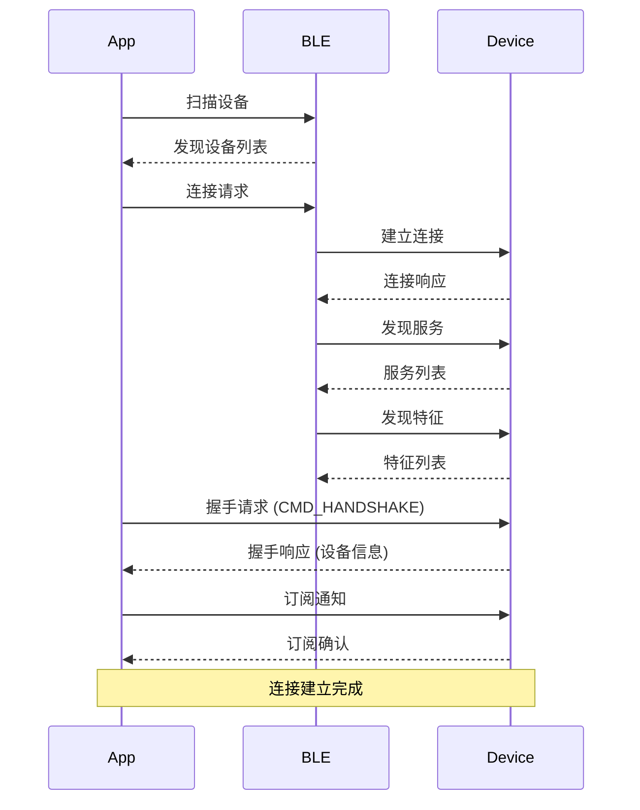
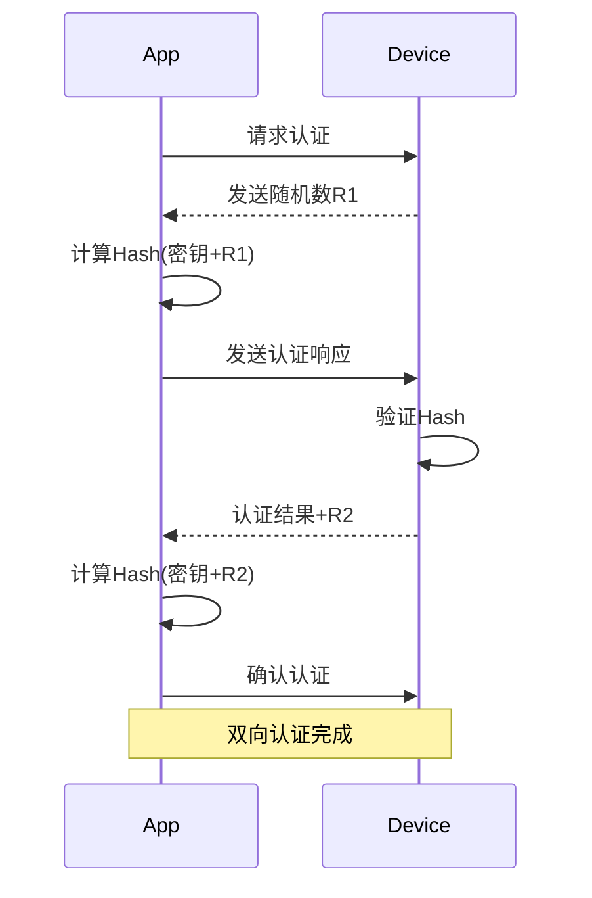
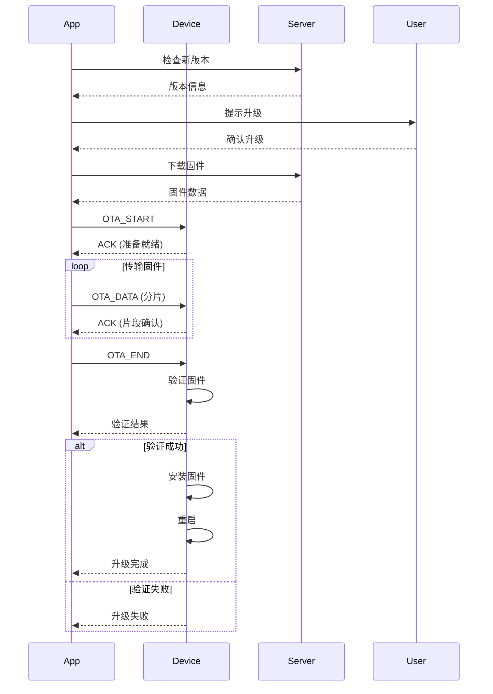

# 蓝牙通信协议

## 1. 协议概述

### 1.1 技术规范
- **蓝牙版本**：Bluetooth 5.0+ (Low Energy)
- **传输速率**：2 Mbps (LE 2M PHY)
- **连接间隔**：7.5ms - 4s (推荐: 20ms)
- **传输功率**：-20 dBm to +10 dBm
- **最大数据包**：244 bytes (with Data Length Extension)

### 1.2 协议层次

```
┌─────────────────────────────────────┐
│     Application Protocol Layer       │
│         (自定义应用协议)              │
├─────────────────────────────────────┤
│          GATT Layer                  │
│   (Generic Attribute Profile)        │
├─────────────────────────────────────┤
│          ATT Layer                   │
│     (Attribute Protocol)             │
├─────────────────────────────────────┤
│         L2CAP Layer                  │
│ (Logical Link Control and Adaptation)│
├─────────────────────────────────────┤
│          HCI Layer                   │
│   (Host Controller Interface)        │
├─────────────────────────────────────┤
│       Link Layer (LL)                │
├─────────────────────────────────────┤
│       Physical Layer                 │
│         (2.4 GHz ISM)                │
└─────────────────────────────────────┘
```

## 2. GATT服务定义

### 2.1 服务UUID定义

```c
// 主服务UUID
#define MAIN_SERVICE_UUID           "00001234-0000-1000-8000-00805F9B34FB"

// 设备信息服务
#define DEVICE_INFO_SERVICE_UUID    "0000180A-0000-1000-8000-00805F9B34FB"

// 电池服务
#define BATTERY_SERVICE_UUID        "0000180F-0000-1000-8000-00805F9B34FB"

// OTA固件更新服务
#define OTA_SERVICE_UUID            "00001530-0000-1000-8000-00805F9B34FB"

// 自定义控制服务
#define CONTROL_SERVICE_UUID        "00002234-0000-1000-8000-00805F9B34FB"
```

### 2.2 特征值定义

```c
// 控制特征值
typedef struct {
    // 设备控制特征 (Write, Write Without Response)
    UUID control_char = "00002235-0000-1000-8000-00805F9B34FB";
    
    // 设备状态特征 (Read, Notify)
    UUID status_char = "00002236-0000-1000-8000-00805F9B34FB";
    
    // 配置特征 (Read, Write)
    UUID config_char = "00002237-0000-1000-8000-00805F9B34FB";
    
    // 数据传输特征 (Write Without Response, Notify)
    UUID data_char = "00002238-0000-1000-8000-00805F9B34FB";
} ControlCharacteristics;

// 特征属性
enum CharacteristicProperties {
    PROPERTY_READ = 0x02,
    PROPERTY_WRITE = 0x08,
    PROPERTY_WRITE_NO_RESPONSE = 0x04,
    PROPERTY_NOTIFY = 0x10,
    PROPERTY_INDICATE = 0x20
};
```

### 2.3 服务架构

```javascript
const GATTStructure = {
  services: [
    {
      uuid: MAIN_SERVICE_UUID,
      characteristics: [
        {
          uuid: CONTROL_CHAR_UUID,
          properties: ['write', 'writeWithoutResponse'],
          descriptors: [
            {
              uuid: '00002902-0000-1000-8000-00805F9B34FB',
              value: 'Device Control Commands'
            }
          ]
        },
        {
          uuid: STATUS_CHAR_UUID,
          properties: ['read', 'notify'],
          descriptors: [
            {
              uuid: '00002902-0000-1000-8000-00805F9B34FB',
              value: 'Device Status Updates'
            }
          ]
        }
      ]
    }
  ]
};
```

## 3. 数据包格式

### 3.1 通用数据包结构

```c
typedef struct {
    uint8_t  header;      // 包头标识 (0xAA)
    uint8_t  version;     // 协议版本
    uint8_t  cmd;         // 命令类型
    uint8_t  seq;         // 序列号
    uint16_t length;      // 数据长度
    uint8_t  data[240];   // 数据载荷
    uint16_t crc16;       // CRC16校验
    uint8_t  footer;      // 包尾标识 (0x55)
} __attribute__((packed)) BLEPacket;

// 数据包示例
// [AA] [01] [02] [00] [00 0A] [01 02 03 04 05 06 07 08 09 0A] [AB CD] [55]
//  头   版本  命令  序号   长度              数据                CRC    尾
```

### 3.2 命令类型定义

```c
enum CommandType {
    // 系统命令 (0x00 - 0x1F)
    CMD_HANDSHAKE           = 0x00,  // 握手
    CMD_HEARTBEAT          = 0x01,  // 心跳
    CMD_GET_INFO           = 0x02,  // 获取设备信息
    CMD_GET_STATUS         = 0x03,  // 获取状态
    CMD_RESET              = 0x04,  // 重置设备
    CMD_SLEEP              = 0x05,  // 进入睡眠
    CMD_WAKEUP             = 0x06,  // 唤醒
    
    // 控制命令 (0x20 - 0x3F)
    CMD_VIBRATE            = 0x20,  // 震动控制
    CMD_SET_INTENSITY      = 0x21,  // 设置强度
    CMD_SET_PATTERN        = 0x22,  // 设置模式
    CMD_STOP               = 0x23,  // 停止
    CMD_PULSE              = 0x24,  // 脉冲
    CMD_WAVE               = 0x25,  // 波形
    CMD_CUSTOM             = 0x26,  // 自定义
    
    // 配置命令 (0x40 - 0x5F)
    CMD_SET_CONFIG         = 0x40,  // 设置配置
    CMD_GET_CONFIG         = 0x41,  // 获取配置
    CMD_SAVE_CONFIG        = 0x42,  // 保存配置
    CMD_FACTORY_RESET      = 0x43,  // 恢复出厂
    
    // OTA命令 (0x60 - 0x7F)
    CMD_OTA_START          = 0x60,  // 开始升级
    CMD_OTA_DATA           = 0x61,  // 传输数据
    CMD_OTA_END            = 0x62,  // 结束升级
    CMD_OTA_VERIFY         = 0x63,  // 验证固件
    
    // 响应命令 (0x80 - 0xFF)
    CMD_ACK                = 0x80,  // 确认
    CMD_NACK               = 0x81,  // 否认
    CMD_ERROR              = 0x82,  // 错误
    CMD_BUSY               = 0x83,  // 忙碌
};
```

### 3.3 数据包详细定义

#### 震动控制包
```c
typedef struct {
    uint8_t  channel;      // 通道 (0:A, 1:B, 2:BOTH)
    uint8_t  mode;         // 模式
    uint8_t  intensity;    // 强度 (0-100)
    uint16_t duration;     // 持续时间 (ms)
    uint16_t frequency;    // 频率 (Hz)
    uint8_t  pattern[32];  // 自定义模式数据
} __attribute__((packed)) VibrateCommand;
```

#### 设备状态包
```c
typedef struct {
    uint8_t  battery;      // 电量 (0-100%)
    uint8_t  charging;     // 充电状态
    uint8_t  channel_a;    // 通道A状态
    uint8_t  channel_b;    // 通道B状态
    int8_t   rssi;         // 信号强度
    uint16_t voltage;      // 电压 (mV)
    uint16_t current;      // 电流 (mA)
    uint32_t uptime;       // 运行时间 (秒)
    uint8_t  temperature;  // 温度 (℃)
    uint8_t  error_code;   // 错误码
} __attribute__((packed)) DeviceStatus;
```

## 4. 通信流程

### 4.1 连接建立流程



### 4.2 数据传输流程

```c
// 发送数据流程
bool sendCommand(uint8_t cmd, uint8_t* data, uint16_t len) {
    BLEPacket packet;
    
    // 1. 构造数据包
    packet.header = 0xAA;
    packet.version = PROTOCOL_VERSION;
    packet.cmd = cmd;
    packet.seq = getNextSequence();
    packet.length = len;
    memcpy(packet.data, data, len);
    
    // 2. 计算CRC
    packet.crc16 = calculateCRC16(&packet, sizeof(packet) - 3);
    packet.footer = 0x55;
    
    // 3. 分片发送（如果需要）
    if (sizeof(packet) > MTU_SIZE) {
        return sendFragmented(&packet);
    }
    
    // 4. 发送数据
    return bleWrite(&packet, sizeof(packet));
}

// 接收数据流程
void onDataReceived(uint8_t* data, uint16_t len) {
    static uint8_t buffer[512];
    static uint16_t bufferIndex = 0;
    
    // 1. 数据缓存
    memcpy(buffer + bufferIndex, data, len);
    bufferIndex += len;
    
    // 2. 查找完整包
    BLEPacket* packet = findCompletePacket(buffer, bufferIndex);
    if (packet == NULL) return;
    
    // 3. 验证CRC
    if (!verifyCRC(packet)) {
        sendNACK(packet->seq);
        return;
    }
    
    // 4. 处理命令
    processCommand(packet);
    
    // 5. 发送ACK
    sendACK(packet->seq);
}
```

### 4.3 心跳机制

```c
// 心跳定时器
void heartbeatTimer() {
    static uint32_t lastHeartbeat = 0;
    uint32_t now = millis();
    
    if (now - lastHeartbeat > HEARTBEAT_INTERVAL) {
        sendHeartbeat();
        lastHeartbeat = now;
        
        // 检查超时
        if (now - lastResponse > HEARTBEAT_TIMEOUT) {
            handleDisconnection();
        }
    }
}

// 心跳包格式
typedef struct {
    uint32_t timestamp;    // 时间戳
    uint8_t  status;       // 设备状态
    uint8_t  battery;      // 电量
} HeartbeatPacket;
```

## 5. 安全机制

### 5.1 配对与绑定

```c
// 配对参数
typedef struct {
    uint8_t io_capability;     // IO能力
    uint8_t oob_data;          // OOB数据
    uint8_t auth_req;          // 认证需求
    uint8_t max_key_size;      // 最大密钥长度
    uint8_t init_key_dist;     // 初始密钥分发
    uint8_t resp_key_dist;     // 响应密钥分发
} PairingParameters;

// 安全级别
enum SecurityLevel {
    SECURITY_NONE = 0,         // 无安全
    SECURITY_LOW = 1,          // 低安全（无配对）
    SECURITY_MEDIUM = 2,       // 中安全（配对）
    SECURITY_HIGH = 3,         // 高安全（配对+加密）
    SECURITY_FIPS = 4          // FIPS级别
};
```

### 5.2 数据加密

```c
// AES-128加密
void encryptData(uint8_t* data, uint16_t len, uint8_t* key) {
    AES_CTX ctx;
    uint8_t iv[16] = {0}; // 初始化向量
    
    // 初始化AES
    AES_init(&ctx, key, iv, AES_MODE_CBC);
    
    // 加密数据
    AES_encrypt(&ctx, data, len);
}

// 会话密钥生成
void generateSessionKey(uint8_t* deviceId, uint8_t* random) {
    uint8_t input[32];
    memcpy(input, deviceId, 16);
    memcpy(input + 16, random, 16);
    
    // 使用SHA256生成会话密钥
    SHA256(input, 32, sessionKey);
}
```

### 5.3 认证流程



## 6. 错误处理

### 6.1 错误码定义

```c
enum ErrorCode {
    ERR_NONE                = 0x00,  // 无错误
    ERR_INVALID_PARAM       = 0x01,  // 参数无效
    ERR_UNSUPPORTED_CMD     = 0x02,  // 不支持的命令
    ERR_CRC_FAILED          = 0x03,  // CRC校验失败
    ERR_TIMEOUT             = 0x04,  // 超时
    ERR_BUSY                = 0x05,  // 设备忙
    ERR_LOW_BATTERY         = 0x06,  // 电量低
    ERR_OVERHEATING         = 0x07,  // 过热
    ERR_HARDWARE            = 0x08,  // 硬件错误
    ERR_FIRMWARE            = 0x09,  // 固件错误
    ERR_AUTH_FAILED         = 0x0A,  // 认证失败
    ERR_MEMORY_FULL         = 0x0B,  // 内存满
    ERR_CONNECTION_LOST     = 0x0C,  // 连接丢失
};

// 错误处理
void handleError(uint8_t errorCode) {
    switch(errorCode) {
        case ERR_CRC_FAILED:
            requestRetransmission();
            break;
        case ERR_TIMEOUT:
            reconnect();
            break;
        case ERR_LOW_BATTERY:
            notifyLowBattery();
            break;
        case ERR_OVERHEATING:
            enterCooldownMode();
            break;
        default:
            logError(errorCode);
    }
}
```

### 6.2 重传机制

```c
typedef struct {
    uint8_t  seq;          // 序列号
    uint8_t  retryCount;   // 重试次数
    uint32_t timestamp;    // 时间戳
    uint8_t  data[256];    // 数据
    uint16_t length;       // 长度
} RetransmitBuffer;

// 重传管理
class RetransmitManager {
    RetransmitBuffer buffer[MAX_RETRANSMIT_BUFFER];
    
    void addToBuffer(BLEPacket* packet) {
        // 添加到重传缓冲区
    }
    
    void checkRetransmit() {
        uint32_t now = millis();
        
        for (int i = 0; i < MAX_RETRANSMIT_BUFFER; i++) {
            if (buffer[i].seq != 0) {
                if (now - buffer[i].timestamp > RETRANSMIT_TIMEOUT) {
                    if (buffer[i].retryCount < MAX_RETRY) {
                        retransmit(&buffer[i]);
                        buffer[i].retryCount++;
                        buffer[i].timestamp = now;
                    } else {
                        handleTransmitFailure(&buffer[i]);
                    }
                }
            }
        }
    }
};
```

## 7. 性能优化

### 7.1 连接参数优化

```c
// 连接参数配置
typedef struct {
    uint16_t minInterval;  // 最小连接间隔 (7.5ms - 4s)
    uint16_t maxInterval;  // 最大连接间隔
    uint16_t latency;      // 从机延迟 (0 - 499)
    uint16_t timeout;      // 监督超时 (100ms - 32s)
} ConnectionParams;

// 场景化参数配置
ConnectionParams getOptimalParams(UseCase useCase) {
    switch(useCase) {
        case REALTIME_CONTROL:
            return {7.5, 15, 0, 1000};    // 低延迟
            
        case AUDIO_STREAMING:
            return {20, 30, 0, 2000};     // 平衡
            
        case POWER_SAVING:
            return {100, 200, 4, 5000};   // 省电
            
        default:
            return {30, 50, 0, 3000};     // 默认
    }
}
```

### 7.2 数据传输优化

```c
// 数据压缩
uint16_t compressData(uint8_t* input, uint16_t inLen, 
                      uint8_t* output, uint16_t outMax) {
    // 使用LZ4或类似算法压缩
    return LZ4_compress(input, output, inLen, outMax);
}

// 批量传输
void batchTransmit(Command* commands, uint8_t count) {
    BatchPacket batch;
    batch.count = count;
    
    for (int i = 0; i < count; i++) {
        batch.commands[i] = commands[i];
    }
    
    sendCommand(CMD_BATCH, &batch, sizeof(batch));
}

// 预测性传输
void predictiveTransmit() {
    // 基于历史模式预测下一个命令
    // 提前准备数据减少延迟
}
```

### 7.3 功耗优化

```c
// 功耗管理
class PowerManager {
    enum PowerMode {
        MODE_ACTIVE,       // 活跃模式
        MODE_IDLE,         // 空闲模式
        MODE_SLEEP,        // 睡眠模式
        MODE_DEEP_SLEEP    // 深度睡眠
    };
    
    void optimizePower() {
        if (isIdle() > IDLE_THRESHOLD) {
            enterSleepMode();
        }
        
        if (batteryLevel < LOW_BATTERY_THRESHOLD) {
            reduceTxPower();
            increaseConnectionInterval();
        }
    }
    
    void enterSleepMode() {
        // 降低广播频率
        setAdvertisingInterval(1000);
        
        // 关闭不必要的外设
        disableUnusedPeripherals();
        
        // 进入低功耗模式
        enterLowPowerMode();
    }
};
```

## 8. 调试与测试

### 8.1 调试日志

```c
// 日志级别
enum LogLevel {
    LOG_ERROR = 0,
    LOG_WARN = 1,
    LOG_INFO = 2,
    LOG_DEBUG = 3,
    LOG_VERBOSE = 4
};

// 日志宏定义
#define BLE_LOG(level, fmt, ...) \
    do { \
        if (level <= LOG_LEVEL) { \
            printf("[BLE][%s] " fmt "\n", \
                   getLogLevelStr(level), ##__VA_ARGS__); \
        } \
    } while(0)

// 协议调试
void debugProtocol(BLEPacket* packet) {
    BLE_LOG(LOG_DEBUG, "TX: cmd=0x%02X seq=%d len=%d", 
            packet->cmd, packet->seq, packet->length);
    
    if (LOG_LEVEL >= LOG_VERBOSE) {
        hexDump(packet->data, packet->length);
    }
}
```

### 8.2 测试用例

```c
// 单元测试
void testProtocol() {
    // 测试数据包构造
    testPacketConstruction();
    
    // 测试CRC计算
    testCRCCalculation();
    
    // 测试加密解密
    testEncryption();
    
    // 测试命令处理
    testCommandProcessing();
    
    // 测试错误处理
    testErrorHandling();
}

// 集成测试
void testIntegration() {
    // 连接测试
    testConnection();
    
    // 数据传输测试
    testDataTransfer();
    
    // 压力测试
    testStress();
    
    // 稳定性测试
    testStability();
}
```

## 9. 固件升级 (OTA)

### 9.1 OTA流程



### 9.2 OTA数据结构

```c
// OTA头部
typedef struct {
    uint32_t magic;        // 魔数 (0xDEADBEEF)
    uint32_t version;      // 版本号
    uint32_t size;         // 固件大小
    uint32_t crc32;        // CRC32校验
    uint32_t timestamp;    // 构建时间
    uint8_t  signature[64]; // 数字签名
} OTAHeader;

// OTA数据包
typedef struct {
    uint16_t index;        // 片段索引
    uint16_t total;        // 总片段数
    uint16_t length;       // 数据长度
    uint8_t  data[128];    // 数据内容
} OTADataPacket;
```

## 10. 兼容性考虑

### 10.1 iOS平台

```swift
// iOS BLE限制
struct iOSLimitations {
    let backgroundModes = ["bluetooth-central", "bluetooth-peripheral"]
    let maxMTU = 512
    let maxConnections = 7
    let advertisingRestrictions = true
}

// CoreBluetooth实现
class BLEManageriOS: NSObject, CBCentralManagerDelegate {
    func centralManager(_ central: CBCentralManager, 
                       didDiscover peripheral: CBPeripheral) {
        // 处理设备发现
    }
    
    func peripheral(_ peripheral: CBPeripheral, 
                   didUpdateValueFor characteristic: CBCharacteristic) {
        // 处理数据接收
    }
}
```

### 10.2 Android平台

```kotlin
// Android BLE实现
class BLEManagerAndroid {
    private val bluetoothAdapter = BluetoothAdapter.getDefaultAdapter()
    
    // 扫描回调
    private val scanCallback = object : ScanCallback() {
        override fun onScanResult(callbackType: Int, result: ScanResult) {
            // 处理扫描结果
        }
    }
    
    // GATT回调
    private val gattCallback = object : BluetoothGattCallback() {
        override fun onConnectionStateChange(gatt: BluetoothGatt, 
                                            status: Int, 
                                            newState: Int) {
            // 处理连接状态变化
        }
        
        override fun onCharacteristicChanged(gatt: BluetoothGatt,
                                            characteristic: BluetoothGattCharacteristic) {
            // 处理数据接收
        }
    }
}
```

## 更新历史

| 版本 | 日期 | 更新内容 | 更新人 |
|------|------|---------|--------|
| v2.0 | 2025-08-07 | 完整的蓝牙通信协议文档 | System |
| v1.0 | 2025-08-01 | 初始协议版本 | System |